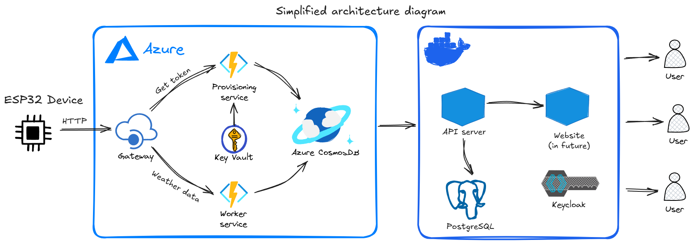
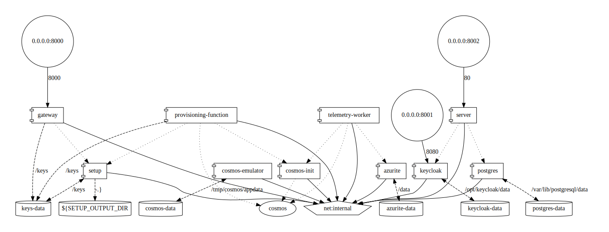

# Heavy weather
Yet another weather station application - designed with low-cost operation and scalability in mind.

## About
Heavy Weather is an end-to-end weather monitoring solution designed for scalability and cost-effectiveness. The system collects real-time weather data from ESP32-based sensors, processes it through Azure cloud infrastructure, and serves it via a REST API.



## Modules
| Directory | Description |
| - | - |
| **cli** | Python tool (`hw`) that simulates a weather station device. |
| **deploy** | Reusable Terraform module defining Azure infrastructure. |
| **deploy** | Local docker compose infrastructure - alternative to `deploy` for developement. |
| **firmware** | PlatformIO project for the ESP32 (outdated). |
| **provisioning-service** | Go service for device registration and JWT issuance. |
| **server** | .NET 8 API for weather history and device management to end users. |

<!--## Getting started
...Link to physical station instructions
...device instructions
...terraform
...function build
...docker compose
...cli-->

## Docker

### Dockerfile locations
```text
root
├── cli
│   └── Dockerfile
├── local
│   ├── cosmos-init
│   │   └── Dockerfile
│   ├── gateway
│   │   └── Dockerfile
│   └── setup
│       └── Dockerfile
├── provisioning-service
│   └── Dockerfile
├── server
│   └── Dockerfile
└── telemetry-worker
    └── Worker
        └── Dockerfile
```

### Docker Images

| Component | GitHub Container Registry | Docker Hub |
| :--- | :--- | :--- |
| CLI | `ghcr.io/mkkl1/weather-station/hw-cli:latest` | `mkkl1/hw-cli:latest` |
| Cosmos Init | `ghcr.io/mkkl1/weather-station/cosmos-init:latest` | `mkkl1/cosmos-init:latest` |
| Local Gateway | `ghcr.io/mkkl1/weather-station/local-gateway:latest` | `mkkl1/local-gateway:latest` |
| Local Setup | `ghcr.io/mkkl1/weather-station/local-setup:latest` | `mkkl1/local-setup:latest` |
| Provisioning Service | `ghcr.io/mkkl1/weather-station/hw-provisioning-service:latest` | `mkkl1/hw-provisioning-service:latest` |
| Server | `ghcr.io/mkkl1/weather-station/hw-server:latest` | `mkkl1/hw-server:latest` |
| Telemetry Worker | `ghcr.io/mkkl1/weather-station/hw-telemetry-worker:latest` | `mkkl1/hw-telemetry-worker:latest` |

### Security Scans
`root/trivy`

### Running Local Stack
To start the local development stack via `docker-compose.yml`:
1. Copy example .env:
    ```bash
    cp .env.example .env
    ```
2. Start the Docker containers in detached mode:
    ```bash
    docker compose up -d
    ```

### Docker compose visualization

