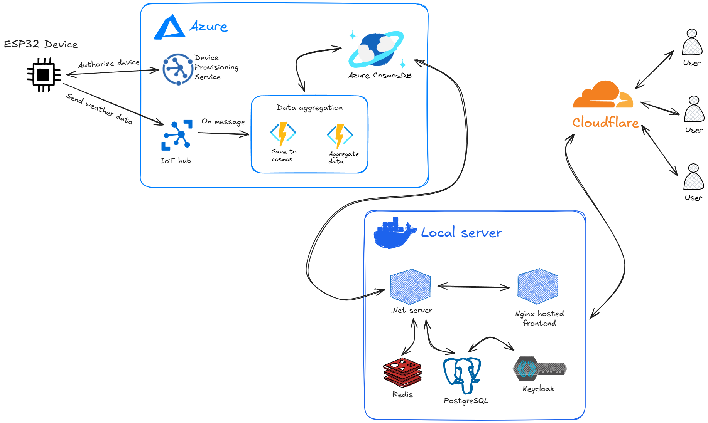

# Heavy weather
Yet another weather station application - designed with low-cost operation and scalability in mind.

## About
Heavy Weather is an end-to-end weather monitoring solution designed for scalability and cost-effectiveness. The system collects real-time weather data from ESP32-based sensors, processes it through Azure cloud infrastructure, and serves it via a REST API.

## Modules
| Directory | Description |
| - | - |
| **cli** | Python tool (`hw`) that simulates a weather station device. |
| **deploy** | Reusable Terraform module defining Azure infrastructure. |
| **firmware** | PlatformIO project for the ESP32. |
| **provisioning-service** | Go service for device registration and JWT issuance. |
| **server** | .NET 8 backend API. |
| **telemetry-worker** | Azure Functions worker for telemetry ingestion and processing. |

## Getting started
...Link to physical station instructions
...device instructions
...terraform
...function build
...docker compose
...cli

## Roadmap